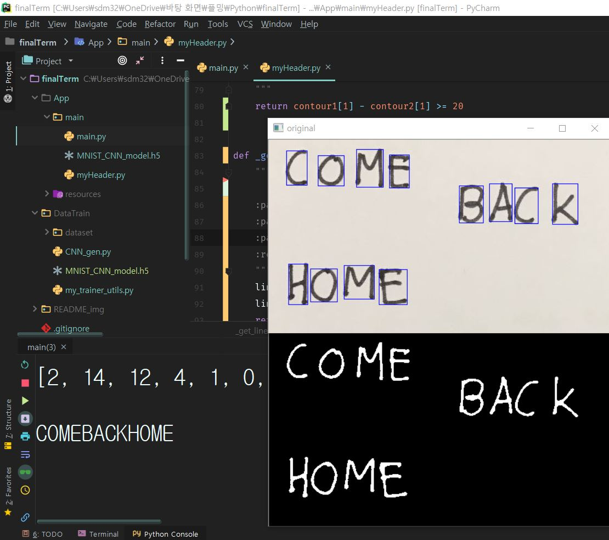

딥러닝 기반 OCR
==================================================================
파이썬  입문3주차, openCV 입문 1주차가 만드는  
기적의 CNN 딥러닝 기반 OCR 프로젝트

**프로젝트 구조 ** 
&nbsp; App  
&nbsp;&nbsp;&nbsp;&nbsp; |-- main.py     &nbsp;&nbsp;&nbsp;&nbsp;&nbsp;&nbsp;&nbsp; 프로젝트 실행 파일  
&nbsp;&nbsp;&nbsp;&nbsp; |-- my_util.py  &nbsp;&nbsp;&nbsp;&nbsp;&nbsp;mani.py 에서 사용하는 함수들
  

&nbsp; DataTrain  
&nbsp;&nbsp;&nbsp;&nbsp; |-- CNN_gen.py  &nbsp;&nbsp;&nbsp;&nbsp;&nbsp;&nbsp;&nbsp; CNN 모델을 만드는 파일 
 
&nbsp;&nbsp;&nbsp;&nbsp; |-- my_trainer_util.py &nbsp;&nbsp;&nbsp;&nbsp;&nbsp; ㄴ> 여기서 쓰이는 함수들

--------------------------------------------------------------------
 

